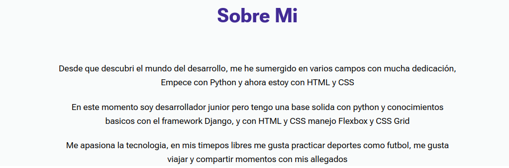
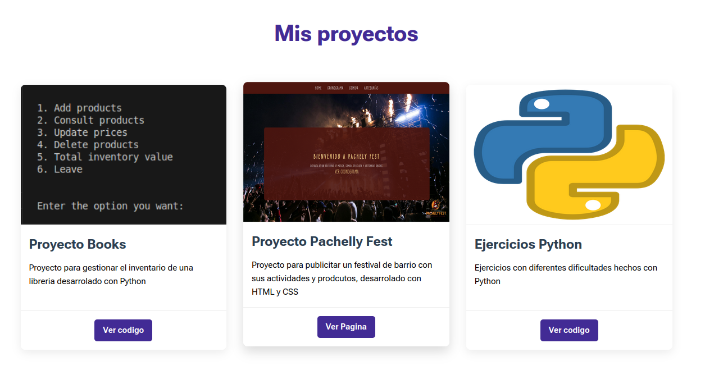
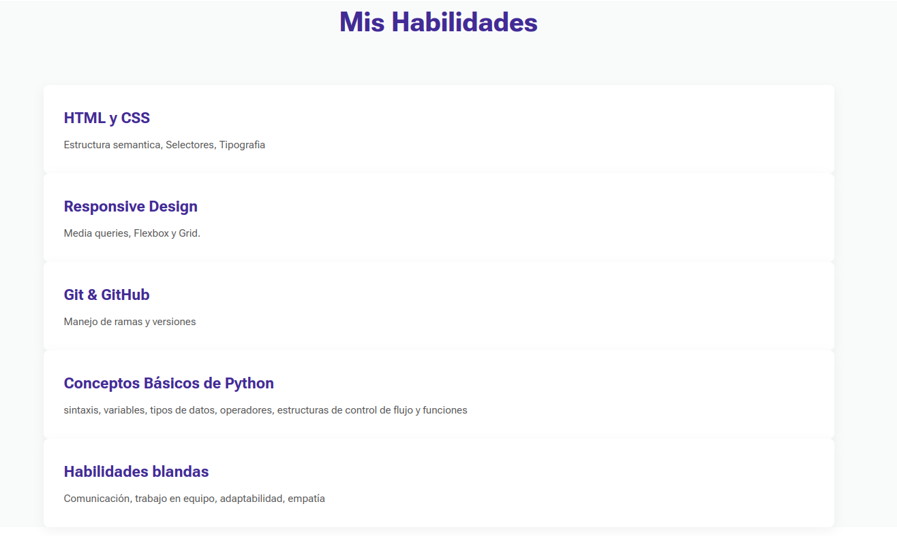
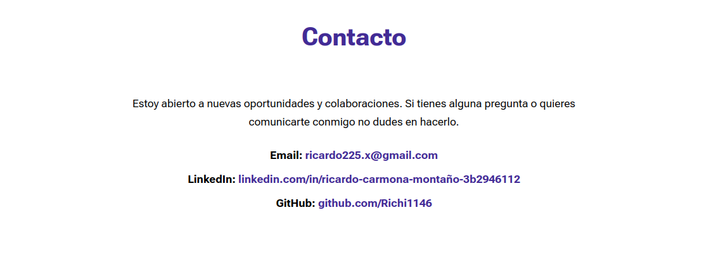

# prueba_desempeno -- Portafolio Personal

## 📂 Contenido
Pagina web con la informacion general de mi persona en el ambito de desarrollo tales como:

### Inicio:

* Sección de inicio para decir quien soy y como me llamo.


* Sección sobre mi.



* Sección de mis proyectos como desarrollador.



* Sección de mis habilidades.



* Sección de contacto.



* Navbar y Footer


## 🌐 Tecnologias usadas
    HTML5
    CSS3

## Cómo ejecutar la pagina
1. Clona este repositorio con el siguiente comando:
    
    ```bash
    git clone https://github.com/Richi1146/prueba_desempeno.git
    ```
2. Abre el archivo `index.html` en tu navegador favorito.
3. Explora las diferentes secciones

## 👨‍🎓 Información Personal:

Nombre: Ricardo Carmona Montaño

Clan: Tesla

Correo: ricardo225.x@gmail.com

Documento de Identidad: 1001250466


